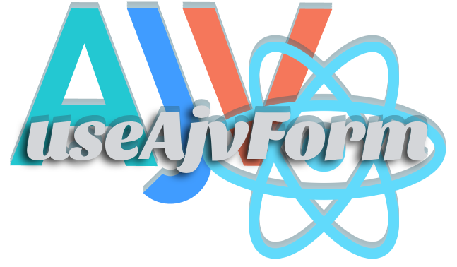

# React AJV Schema



[use-ajv-form](https://github.com/agjs/use-ajv-form) is a custom React Hook that enables you to generate your form logic and validation based on [Ajv JSON Schema Validator](https://ajv.js.org/).

It integrates seamlessly with any form and is completely agnostic from your form markup. It simply provides the state and validation. You choose how you want to present the errors and organise your forms. In simple words, it's completely decoupled from how your forms work, look and feel.

## Why

Validating forms manually is a painful process. Ajv solves that by not only providing validation based on valid [JSON Schema Specification](https://json-schema.org/specification.html), but also, provides [plugins](https://ajv.js.org/packages/) that allows further extension and creation of custom validators. That means that you can extend your schema with infinite amount of validators, and keep your forms still purely depend on the schema, without introducing manual if statements all over the place.

This library is used by all forms on [Programmer Network](https://programmer.network/) and is Open Sourced due to our amazing community on an official [Programmer Network Twitch Channel](https://twitch.tv/programmer_network).

---

## Features

- Form JSON Schema Validation
- Dirty state checking
- Consume remote errors as part of the schema, e.g. `username already taken`. In simple words, errors coming from your API
- Maps 1:1 with nested objects. In simple words, a form can generate the exact object shape that you want, no need for manual mapping before e.g. API submission

---

## Install

`yarn add @programmer_network/use-ajv-form`

or

`npm install @programmer_network/use-ajv-form`

---

## Usage

[Codesandbox Live Demo](https://google.com)

Let's start with a simple example.

Let's create our form object. This object contains methods and state that our form will depend on.

```javascript
import { useAjvForm } from '@programmer_network/useAjvForm';

const initialState = {
  title: '',
  description: '',
};

const schema = {
  type: 'object',
  required: ['title'],
  properties: {
    title: {
      type: 'string',
    },
    description: {
      type: 'string',
      minLength: 20,
      errorMessages: {
        minLength: 'Description is too short. At least 20 characters expected.',
      },
    },
  },
};

const form = useAjvForm(initialState, schema, remoteErrors);
```

Then we create a onSubmit form handler that will call our validators.

```js
const handleSubmit = (event) => {
  event.preventDefault();

  if (!form.isValid()) {
    // form is invalid, exit early
    // when this happens, our hook will update the fields that failed validation
    return;
  }

  // validation successful, call some API
  axios.post('someUrl', form.data);
};
```

Generally, your own Input component takes a value and an error. If you are using component composition, this might look a bit different, but you get the point.

```jsx
// your custom input component
const CustomInput = ({ value, error, name }) => {
  <input type="text" name={name} value={value} />;
  {
    error && <span>{error}</span>;
  }
};
```

As you may notice, for every given property in your schema, our hook will create a value and error properties. Error property is initially set to null, and the value to whatever values are set in your initial state.

```jsx
<form onSubmit={handleSubmit}>
  <CustomInput name="title" value={form.state.title.value} />
  <CustomInput name="description" value={form.state.description.value} />
  <button type="submit">Submit</button>
</form>
```
